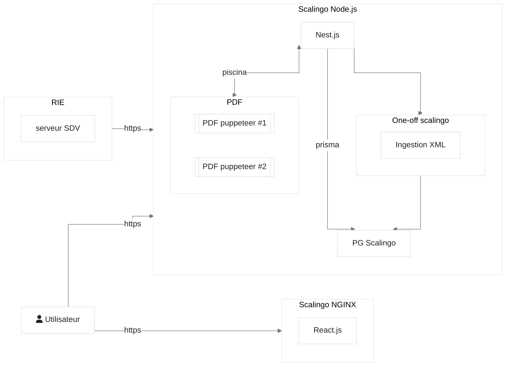

# Fondation

Donner au CSM (Conseil Supérieur de la Magistrature) les moyens d'un travail efficace et de qualité afin de concourir à la continuité du fonctionnement de l'institution judiciaire et de contribuer à une RH vertueuse du corps de la magistrature.

## Architecture



## Bonnes pratiques

PNPM est configuré par défaut avec les options suivantes dans le fichier [pnpm-workspace.yaml](./pnpm-workspace.yaml):

```yaml
preferFrozenLockfile: true # n'installe que les dépendances du lockfile
minimumReleaseAge: 10080 # attend au moins 7 jours avant de proposer une dépendance
allowBuilds: # liste blanche des paquets autorisés à exécuter un script d'install
  '@nestjs/core': true
  bcrypt: true # compilation native nécessaire
  prisma: false # généré manuellement (voir installation) car requiert une base lancée
  '@prisma/client': false
  puppeteer: false
```

Tout paquet absent de `allowBuilds` est empêché d'exécuter ses scripts d'installation
(`postinstall`, etc.), pour se protéger des attaques par supply chain
(cf. [SHAI-HULUD 2](https://www.cert.ssi.gouv.fr/actualite/CERTFR-2025-ACT-051/)). On n'autorise
que le strict nécessaire : `bcrypt`, `@nestjs/core` et `@swc/core` pour leur compilation native.

> [!WARNING]
> Ces mesures n'empêchent pas la plus grande vigilance avant d'installer une dépendance.
> Chaque installation de dépendance doit être justifiée.

> [!NOTE]
> `prisma` est volontairement à `false` : le client est généré manuellement avec
> `prisma generate --sql`, qui doit se connecter à une base déjà lancée (voir l'étape
> d'installation).

## Contribution

> [!NOTE]
> Le fichier [CLAUDE.md](./CLAUDE.md) contient de nombreuses informations relatives au style
> utilisé dans le projet. Il est valable pour les LLMs, mais aussi très utile pour les humains.
>
> Autrement, ne pas hésiter à se référer à ce document:
> [https://github.com/zakirullin/cognitive-load/blob/main/README.md](https://github.com/zakirullin/cognitive-load/blob/main/README.md)

Les projets front et back utilisent des conventions légèrement différentes. Pour les expliciter
eslint et prettier ont chacun une configuration définie dans chaque projet.

Pour chaque pull request, on vérifie que le code proposé respecte ces conventions. Pour éviter des cycles de CI
inutiles, on peut utiliser le hook [husky](https://typicode.github.io/husky) `prepush` dans l'application en
utilisant `npx husky` pour l'installer.

Autrement à la racine du projet:

```ts
$ pnpm run prepush
$ pnpm run types:check; pnpm run lint:check; pnpm run format:check;
```

Globalement, configurer son IDE pour utiliser ces configuration est le mieux, mais le workspace PNPM
peut provoquer des conflits parfois.

## Procédure d'installation de l'application Back

Sauf indication contraire, les commandes se lancent depuis le dossier `apps/api`.

1. Installation des dépendances (depuis la racine)

```bash
pnpm install
```

2. Copier le fichier `.env.example` vers `.env`

```bash
cp .env.example .env
```

Le fichier `.env` (gitignoré) contient toutes les variables nécessaires pour démarrer
l'application localement. `DATABASE_URL` pointe vers un Postgres local lancé dans Docker
(étape 3), sur le port non-standard `5435` pour ne pas entrer en conflit avec un Postgres
déjà présent sur la machine.

3. Démarrer les services et la base de données

```bash
docker compose --file ./test/docker-compose-test.yaml up -d   # Postgres :5435 + MinIO/S3 :9000
pnpm run prisma migrate deploy
```

Pour la base de test:

```bash
npx dotenvx run -f .env.e2e -f .env -- pnpm run prisma migrate deploy
```

> [!WARNING]
> Pour le moment, il est très facile de lancer les tests sur la base locale, le mieux
> est d'utiliser le script dans le fichier package.json.

4. Générer le code

```bash
pnpm --filter shared-models build         # types partagés (requis par le back)
pnpm --filter api prisma generate --sql   # client Prisma + requêtes TypedSQL
```

> [!IMPORTANT]
> `prisma generate --sql` se connecte à la base pour typer les requêtes de `prisma/sql/` :
> Postgres doit donc tourner et les migrations être appliquées (étape 3). Ce code n'est pas
> versionné, à relancer après chaque `pnpm install`.

5. Initialiser les buckets S3 (une seule fois)

```bash
node scripts/init-buckets.js
```

6. Lancement de l'application

```bash
pnpm --filter api dev       # back sur :3000, Swagger sur /openapi
pnpm --filter client dev    # front sur :5173
```

7. Créer un utilisateur pour se connecter

```bash
pnpm --filter api build
node --env-file .env dist/cli user register \
  --email jean@example.fr \
  --firstname Jean \
  --lastname Moulin \
  --gender MALE \
  --role MEMBRE_DU_PARQUET
password: *****
repeat password: *****
```

Le CLI est interactif et demandera les informations manquantes si nécessaires.
Rôles disponibles : `MEMBRE_DU_SIEGE`, `MEMBRE_DU_PARQUET`, `MEMBRE_COMMUN`,
`ADJOINT_SECRETAIRE_GENERAL`, `ADMIN` ([voir les rôles](./apps/api/prisma/schemas/identity.prisma#L80)).
Il est recommandé de créer un membre commun et un agent du secrétariat général.

8. Accès à l'application : [http://localhost:5173](http://localhost:5173)

## Tests E2E playwright

Les tests playwright exécutent l'application dans un mode particulier pour faciliter les tests, sans trop s'éloigner du comportement de production.

Il faut déjà démarrer l'application back des tests. Playwright est capable de l'exécuter, mais s'il y a un bug les logs seront plus lisibles dans un processus séparé

```
$ pnpm --filter api start:e2e
```

Démarrer l'appli front

```
$ pnpm --filter client dev
```

Ensuite démarrer playwright

```
$ pnpm --filter client playwright test --ui
```

## Génération du SDK front

Pour générer le code du contrat d'interface entre le front et le back, on utilise
[openapi](https://swagger.io/specification/) dans un mode _code-first_.

La spécification est générée directement depuis nos contrôleurs nest, grâce à

- [@nestjs/swagger](https://docs.nestjs.com/openapi/introduction)
- [nestjs-zod](https://www.npmjs.com/package/nestjs-zod/v/5.0.1)

Swagger UI est exposé par défaut sur [/openapi](http://localhost:3000/openapi).

Le SDK front est généré avec [@hey-api/openapi-ts](https://heyapi.dev/openapi-ts), et ces plugins:

- [typescript](https://heyapi.dev/openapi-ts/plugins/typescript)
- [sdk](https://heyapi.dev/openapi-ts/plugins/sdk)
- [client-fetch](https://heyapi.dev/openapi-ts/clients/fetch)

On ne génère _volontairement pas_ le client @tanstack/react-query puisque ce dernier n'offre
pas la fonctionnalité de _namespacing_ disponible dans le sdk directement.

La configuration de l'outil est disponible dans [apps/client/openapi-ts.config.ts](./apps/client/openapi-ts.config.ts).

### Générer le client

Pour mettre à jour le client, il faut démarrer le back

```
cd apps/api
pnpm run dev
```

Une fois disponible, on peut lancer le script de génération:

```
cd apps/client
pnpm run openapi:generate
```

openapi-ts utilise directement la spécification exposée par nest.

> [!NOTE]
> Le code généré est directement embarqué dans le dépôt de code pour faciliter les choses.

L'api est exploité dans des hooks custom qui retournent la `Query` ou la `Mutation`
de @tanstack/react-query dans le dossier [apps/client/src/queries](./apps/client/src/queries).

```ts
// apps/client/src/queries/auth.queries.ts
import { useQueryClient, useMutation } from '@tanstack/react-query';

/** convention d'utiliser $api en mode namespace */
import * as $api from '@api/sdk';

/** On expose un dictionnaire de fonctions pour générer les clés */
export const authKeys = {
  introspectSession: () => ['introspectSession'],
};

/** L'implémentation est laissée libre */
export function useLogout() {
  const queryClient = useQueryClient();

  return useMutation({
    mutationFn: () => $api.auth.logout(),
    onSuccess: () => queryClient.removeQueries({ queryKey: authKeys.introspectSession() }),
  });
}
```

Enfin, les types générés peuvent être utilisés au niveau des composants depuis `@api/types`.

```tsx
// apps/client/src/components/secretariat-general/membres/details/DetailsMember.tsx
import type { DetailedMemberDto } from '@api/types';
// ...
```
