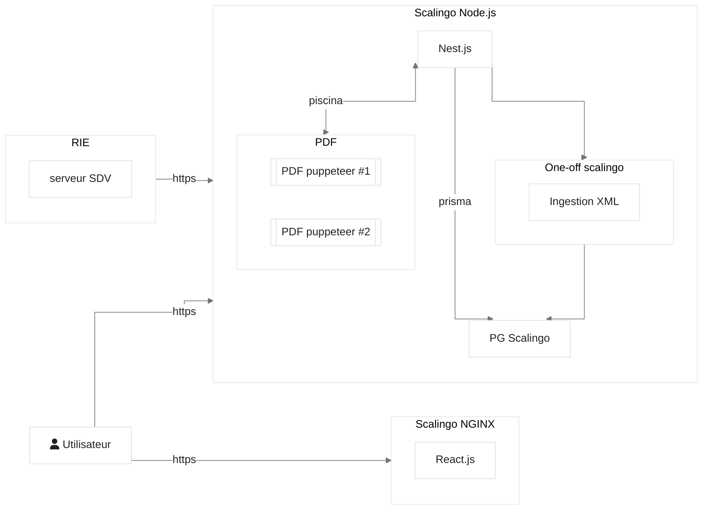

# Fondation

Donner au CSM (Conseil Supérieur de la Magistrature) les moyens d'un travail efficace et de qualité afin de concourir à la continuité du fonctionnement de l'institution judiciaire et de contribuer à une RH vertueuse du corps de la magistrature.

## Architecture



## Installation

Sauf indication contraire, les commandes se lancent depuis le dossier `apps/api`.

1. Installer les dépendances (depuis la racine)

```bash
pnpm install
```

2. Copier `.env.example` vers `.env`

```bash
cp .env.example .env
```

Le fichier `.env` (gitignoré) contient toutes les variables nécessaires pour démarrer l'application
localement. `DATABASE_URL` pointe vers un Postgres local lancé dans Docker (étape 3), sur le port
non-standard `5435` pour ne pas entrer en conflit avec un Postgres déjà présent sur la machine.

3. Démarrer les services et la base de données

```bash
docker compose --file ./test/docker-compose-test.yaml up -d   # Postgres :5435 + MinIO/S3 :9000
pnpm run prisma migrate deploy
```

Pour la base de test :

```bash
npx dotenvx run -f .env.e2e -f .env -- pnpm run prisma migrate deploy
```

> [!WARNING]
> Pour le moment, il est très facile de lancer les tests sur la base locale, le mieux est
> d'utiliser le script dans le fichier package.json.

4. Générer le code

```bash
pnpm --filter shared-models build         # types partagés (requis par le back)
pnpm --filter api prisma generate --sql   # client Prisma + requêtes TypedSQL
```

> [!IMPORTANT]
> `prisma generate --sql` se connecte à la base pour typer les requêtes de `prisma/sql/` : Postgres
> doit donc tourner et les migrations être appliquées (étape 3). Ce code n'est pas versionné, à
> relancer après chaque `pnpm install`.

5. Initialiser les buckets S3 (une seule fois)

```bash
node scripts/init-buckets.js
```

6. Lancer l'application

```bash
pnpm --filter api dev       # back sur :3000, Swagger sur /openapi
pnpm --filter client dev    # front sur :5173
```

7. Créer un utilisateur pour se connecter

```bash
pnpm --filter api build
node --env-file .env dist/cli user register \
  --email jean@example.fr \
  --firstname Jean \
  --lastname Moulin \
  --gender MALE \
  --role MEMBRE_DU_PARQUET
password: *****
repeat password: *****
```

Le CLI est interactif et demandera les informations manquantes si nécessaire. Rôles disponibles :
`MEMBRE_DU_SIEGE`, `MEMBRE_DU_PARQUET`, `MEMBRE_COMMUN`, `ADJOINT_SECRETAIRE_GENERAL`, `ADMIN`
([voir les rôles](./apps/api/prisma/schemas/identity.prisma#L80)). Il est recommandé de créer un
membre commun et un agent du secrétariat général.

8. Accéder à l'application : [http://localhost:5173](http://localhost:5173)

## Migrations (Prisma)

`prisma migrate deploy` applique les migrations existantes. C'est ce qui tourne à l'installation et
au déploiement (prod).

Pour créer une nouvelle migration, on modifie un schéma dans `prisma/schemas/`, puis :

```bash
pnpm run prisma migrate dev --name <nom_de_la_migration>
```

Cette commande crée une base "shadow" temporaire à chaque exécution pour valider les migrations.
L'utilisateur PostgreSQL doit donc pouvoir créer des bases (droit `CREATEDB`). Pas de config à faire :
le Docker de dev l'autorise déjà.

## Génération du SDK front

Le contrat d'interface entre le front et le back est généré en mode _code-first_ : la spécification
[OpenAPI](https://swagger.io/specification/) est produite directement depuis les contrôleurs Nest,
grâce à

- [@nestjs/swagger](https://docs.nestjs.com/openapi/introduction)
- [nestjs-zod](https://www.npmjs.com/package/nestjs-zod/v/5.0.1)

Swagger UI est exposé par défaut sur [/openapi](http://localhost:3000/openapi).

Le SDK front est généré avec [@hey-api/openapi-ts](https://heyapi.dev/openapi-ts) et ses plugins
[typescript](https://heyapi.dev/openapi-ts/plugins/typescript),
[sdk](https://heyapi.dev/openapi-ts/plugins/sdk) et
[client-fetch](https://heyapi.dev/openapi-ts/clients/fetch). On ne génère _volontairement pas_ le
client @tanstack/react-query, qui n'offre pas le _namespacing_ disponible dans le sdk. La
configuration est dans [apps/client/openapi-ts.config.ts](./apps/client/openapi-ts.config.ts).

### Régénérer le client

Le back doit tourner (il expose la spécification) :

```bash
cd apps/api
pnpm run dev
```

Puis :

```bash
cd apps/client
pnpm run openapi:generate
```

> [!NOTE]
> Le code généré est embarqué dans le dépôt pour faciliter les choses.

### Consommer l'API

Le sdk est utilisé dans des hooks custom qui retournent la `Query` ou la `Mutation`
@tanstack/react-query, dans [apps/client/src/queries](./apps/client/src/queries). Les types générés
s'importent depuis `@api/types`.

```ts
// apps/client/src/queries/auth.queries.ts
import { useQueryClient, useMutation } from '@tanstack/react-query';

/** convention d'utiliser $api en mode namespace */
import * as $api from '@api/sdk';

/** On expose un dictionnaire de fonctions pour générer les clés */
export const authKeys = {
  introspectSession: () => ['introspectSession'],
};

/** L'implémentation est laissée libre */
export function useLogout() {
  const queryClient = useQueryClient();

  return useMutation({
    mutationFn: () => $api.auth.logout(),
    onSuccess: () => queryClient.removeQueries({ queryKey: authKeys.introspectSession() }),
  });
}
```

## Tests E2E (Playwright)

Les tests Playwright exécutent l'application dans un mode particulier pour faciliter les tests, sans
trop s'éloigner du comportement de production.

Démarrer d'abord le back des tests. Playwright sait le lancer lui-même, mais dans un processus séparé
les logs sont plus lisibles en cas de bug :

```bash
pnpm --filter api start:e2e
```

Démarrer le front :

```bash
pnpm --filter client dev
```

Puis Playwright :

```bash
pnpm --filter client playwright test --ui
```

## Contribution

> [!NOTE]
> Le fichier [CLAUDE.md](./CLAUDE.md) contient de nombreuses informations relatives au style
> utilisé dans le projet.
>
> Autrement, ne pas hésiter à se référer à ce document:
> [https://github.com/zakirullin/cognitive-load/blob/main/README.md](https://github.com/zakirullin/cognitive-load/blob/main/README.md)

### Conventions et CI

Les projets front et back utilisent des conventions légèrement différentes : oxlint (lint) et oxfmt
(formatage) ont chacun une configuration par projet. Configurer son IDE pour les utiliser est le
mieux même si le workspace pnpm peut parfois créer des conflits.

Chaque pull request vérifie le respect de ces conventions. Pour éviter des cycles de CI inutiles, on
peut installer le hook [husky](https://typicode.github.io/husky) `prepush` avec `npx husky`. Sinon, à
la racine :

```bash
pnpm run prepush
# ou
pnpm run types:check; pnpm run lint:check; pnpm run format:check
```

### Dépendances

pnpm est configuré dans [pnpm-workspace.yaml](./pnpm-workspace.yaml) :

```yaml
preferFrozenLockfile: true # n'installe que les dépendances du lockfile
minimumReleaseAge: 10080 # attend au moins 7 jours avant de proposer une dépendance
allowBuilds: # liste blanche des paquets autorisés à exécuter un script d'install
  '@nestjs/core': true
  bcrypt: true # compilation native nécessaire
  prisma: false # client généré manuellement (voir Installation)
  '@prisma/client': false
  puppeteer: false
```

Tout paquet absent de `allowBuilds` ne peut pas exécuter ses scripts d'installation (`postinstall`,
etc.), pour se protéger des attaques par supply chain (cf.
[SHAI-HULUD 2](https://www.cert.ssi.gouv.fr/actualite/CERTFR-2025-ACT-051/)). On n'autorise que le
strict nécessaire (`bcrypt`, `@nestjs/core`, `@swc/core`) pour leur compilation native.

> [!WARNING]
> Ces mesures ne remplacent pas la vigilance : chaque ajout de dépendance doit être justifié.
