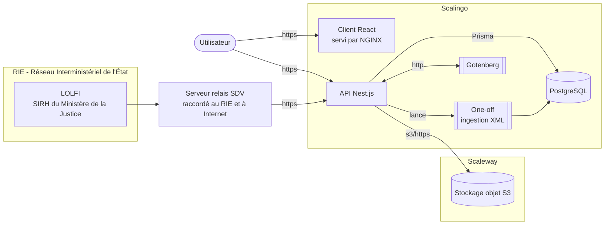

# Fondation

Donner au CSM (Conseil Supérieur de la Magistrature) les moyens d'un travail efficace et de qualité afin de concourir à la continuité du fonctionnement de l'institution judiciaire et de contribuer à une RH vertueuse du corps de la magistrature.

## Organisation du monorepo

Le projet est un workspace [pnpm](https://pnpm.io) composé de :

- [apps/api](./apps/api) : le back-end Nest.js + Prisma
- [apps/client](./apps/client) : le front-end React + Vite
- [apps/api-e2e](./apps/api-e2e) : les tests bout-en-bout de l'api
- [packages/lolfi](./packages/lolfi) : générateur d'archives LOLFI, utilisé par les tests bout-en-bout de l'api et par ceux de Playwright

## Architecture



LOLFI est le SIRH du ministère de la Justice qui suit les carrières des magistrats : ses
extractions XML sont la source des données de nomination. Le RIE n'étant pas connecté à
Internet, un serveur relais fourni par le prestataire SDV, raccordé aux deux réseaux,
transmet ces fichiers chiffrés à l'api.

Gotenberg convertit en PDF le HTML des documents produits par l'api (ordre du jour, PV et
notice de restitution). Il n'est pas déployé depuis ce dépôt : c'est l'image officielle,
hébergée dans sa propre application Scalingo `fondation-gotenberg`.

Le stockage objet, hébergé chez Scaleway et compatible S3, contient les pièces jointes ainsi
que les PDF générés, qui y sont mis en cache pour éviter de les reconstruire à chaque
consultation. En local, il est émulé par MinIO (voir l'installation).

## Installation et lancement

Toutes les commandes ci-dessous se lancent depuis la racine du dépôt.

1. Installation des dépendances

```bash
pnpm install
```

2. Copier le fichier `.env.example` vers `.env`

```bash
cp apps/api/.env.example apps/api/.env
```

Le fichier `apps/api/.env` (gitignoré) contient toutes les variables nécessaires pour démarrer
l'application localement. `DATABASE_URL` pointe vers un Postgres local lancé dans Docker
(étape 3), sur le port non-standard `5435` pour ne pas entrer en conflit avec un Postgres
déjà présent sur la machine.

3. Démarrer les services et la base de données

```bash
docker compose --file apps/api/test/docker-compose-test.yaml up -d   # Postgres :5435 + MinIO/S3 :9000 + Gotenberg :9091
pnpm --filter api prisma migrate deploy
```

Pour la base de test :

```bash
pnpm --filter api exec dotenvx run -f .env.e2e -f .env -- prisma migrate deploy
```

> [!WARNING]
> Il est très facile de lancer les tests sur la base locale par erreur. Toujours passer
> par les scripts du package.json de l'api (comme `start:e2e`), qui chargent `.env.e2e`
> avant `.env` pour cibler la base de test.

4. Générer le code

```bash
pnpm --filter api prisma generate --sql   # client Prisma + requêtes TypedSQL
```

> [!IMPORTANT]
> `prisma generate --sql` se connecte à la base pour typer les requêtes de `prisma/sql/` :
> Postgres doit donc tourner et les migrations être appliquées (étape 3). Ce code n'est pas
> versionné, à relancer après chaque `pnpm install`.

5. Initialiser les buckets S3 (une seule fois)

```bash
node apps/api/scripts/init-buckets.js
```

6. Lancement de l'application

```bash
pnpm --filter api dev       # back sur :3000, Swagger sur /openapi
pnpm --filter client dev    # front sur :5173
```

7. Créer un utilisateur pour se connecter

```bash
pnpm --filter api build
pnpm --filter api exec node --env-file .env dist/cli user register \
  --email jean@example.fr \
  --firstname Jean \
  --lastname Moulin \
  --gender MALE \
  --role MEMBRE_DU_PARQUET
```

Le CLI est interactif et demandera les informations manquantes si nécessaire, à commencer
par le mot de passe :

```
password: *****
repeat password: *****
```

Rôles disponibles : `MEMBRE_DU_SIEGE`, `MEMBRE_DU_PARQUET`, `MEMBRE_COMMUN`,
`ADJOINT_SECRETAIRE_GENERAL`, `ADMIN` (enum `PrismaRoleEnum` dans
[apps/api/prisma/schemas/identity.prisma](./apps/api/prisma/schemas/identity.prisma)).
Il est recommandé de créer un membre commun et un agent du secrétariat général.

8. Accès à l'application : [http://localhost:5173](http://localhost:5173)

## Tests

Les tests unitaires :

```bash
pnpm --filter api test
pnpm --filter client test
```

Les tests bout-en-bout de l'api ([apps/api-e2e](./apps/api-e2e)) démarrent l'api eux-mêmes :
ils ont seulement besoin des services de l'étape 3 et de la base de test migrée.

```bash
pnpm --filter api-e2e test
```

### Playwright

Les tests Playwright exécutent l'application dans un mode particulier pour faciliter les tests, sans trop s'éloigner du comportement de production.

Il faut déjà démarrer l'application back des tests. Playwright est capable de l'exécuter lui-même. S'il y a un bug, les logs seront cependant plus lisibles dans un processus séparé.

```bash
pnpm --filter api start:e2e
```

Démarrer l'appli front

```bash
pnpm --filter client dev
```

Ensuite démarrer Playwright

```bash
pnpm --filter client playwright test --ui   # ou `test:e2e` pour un lancement sans interface
```

## Génération du SDK front

Pour générer le code du contrat d'interface entre le front et le back, on utilise
[OpenAPI](https://swagger.io/specification/) dans un mode _code-first_.

La spécification est générée directement depuis nos contrôleurs Nest, grâce à

- [@nestjs/swagger](https://docs.nestjs.com/openapi/introduction)
- [nestjs-zod](https://www.npmjs.com/package/nestjs-zod/v/5.0.1)

Swagger UI est exposé par défaut sur [/openapi](http://localhost:3000/openapi).

Le SDK front est généré avec [@hey-api/openapi-ts](https://heyapi.dev/openapi-ts) et ces plugins :

- [typescript](https://heyapi.dev/openapi-ts/plugins/typescript)
- [sdk](https://heyapi.dev/openapi-ts/plugins/sdk)
- [client-fetch](https://heyapi.dev/openapi-ts/clients/fetch)

On ne génère _volontairement pas_ le client @tanstack/react-query puisque ce dernier n'offre
pas la fonctionnalité de _namespacing_ disponible dans le sdk directement.

La configuration de l'outil est disponible dans [apps/client/openapi-ts.config.ts](./apps/client/openapi-ts.config.ts).

### Générer le client

openapi-ts utilise directement la spécification exposée par Nest : le back doit donc tourner
(étape 6) avant de lancer la génération depuis la racine.

```bash
pnpm run openapi:generate
```

> [!NOTE]
> Le code généré est directement embarqué dans le dépôt de code pour faciliter les choses.

L'api est exploitée dans des hooks custom qui retournent la `Query` ou la `Mutation`
de @tanstack/react-query dans le dossier [apps/client/src/queries](./apps/client/src/queries).
Les types générés sont importables depuis `@api/types` et les conventions d'écriture de ces
hooks sont décrites dans [CLAUDE.md](./CLAUDE.md).

## Storybook

Le catalogue des composants du front est construit avec [Storybook](https://storybook.js.org/) :

```bash
pnpm --filter client storybook
```

Il est accessible sur [localhost:6006](http://localhost:6006). Une version en ligne est
déployée sur Scalingo à chaque push sur `develop` (lien disponible en interne).

Pour créer une story, voir le [guide Storybook](./apps/client/docs/storybook.md). Un guide
d'utilisation à destination du métier est intégré au Storybook (page "Guide / Bienvenue").

## Contribution

> [!NOTE]
> Le fichier [CLAUDE.md](./CLAUDE.md) contient de nombreuses informations relatives au style
> utilisé dans le projet. Il s'adresse aux LLMs mais sert aussi de référence aux développeurs.
>
> Autrement, ne pas hésiter à se référer à ce document :
> [https://github.com/zakirullin/cognitive-load/blob/main/README.md](https://github.com/zakirullin/cognitive-load/blob/main/README.md)

Les projets front et back utilisent des conventions légèrement différentes. Pour les expliciter,
[oxlint](https://oxc.rs/docs/guide/usage/linter) et [oxfmt](https://oxc.rs/docs/guide/usage/formatter)
ont chacun une configuration définie dans chaque projet (`.oxlintrc.json`, `.oxfmtrc.json`).

Pour chaque pull request, on vérifie que le code proposé respecte ces conventions. Pour éviter des
cycles de CI inutiles, on peut lancer les mêmes vérifications en local depuis la racine :

```bash
pnpm run prepush
```

Le hook [husky](https://typicode.github.io/husky) `prepush` peut automatiser ce lancement avant
chaque push (installation avec `npx husky`).

Globalement, configurer son IDE pour utiliser ces configurations est le mieux. Le workspace PNPM
peut cependant parfois provoquer des conflits.

## Sécurité des dépendances

PNPM est configuré par défaut avec les options suivantes dans le fichier [pnpm-workspace.yaml](./pnpm-workspace.yaml) :

```yaml
preferFrozenLockfile: true # n'installe que les dépendances du lockfile
minimumReleaseAge: 10080 # attend au moins 7 jours avant de proposer une dépendance
allowBuilds: # liste blanche des paquets autorisés à exécuter un script d'install
  '@nestjs/core': true
  '@prisma/client': false
  '@swc/core': true # compilation native nécessaire
  '@prisma/engines': false
  '@scarf/scarf': false
  '@sentry/cli': false
  bcrypt: true # compilation native nécessaire
  prisma: false # généré manuellement (voir installation) car requiert une base lancée
```

Tout paquet absent de `allowBuilds` est empêché d'exécuter ses scripts d'installation
(`postinstall`, etc.), pour se protéger des attaques par supply chain
(cf. [SHAI-HULUD 2](https://www.cert.ssi.gouv.fr/actualite/CERTFR-2025-ACT-051/)). On n'autorise
que le strict nécessaire : `bcrypt`, `@nestjs/core` et `@swc/core` pour leur compilation native.

> [!WARNING]
> Ces mesures n'empêchent pas la plus grande vigilance avant d'installer une dépendance.
> Chaque installation de dépendance doit être justifiée.
