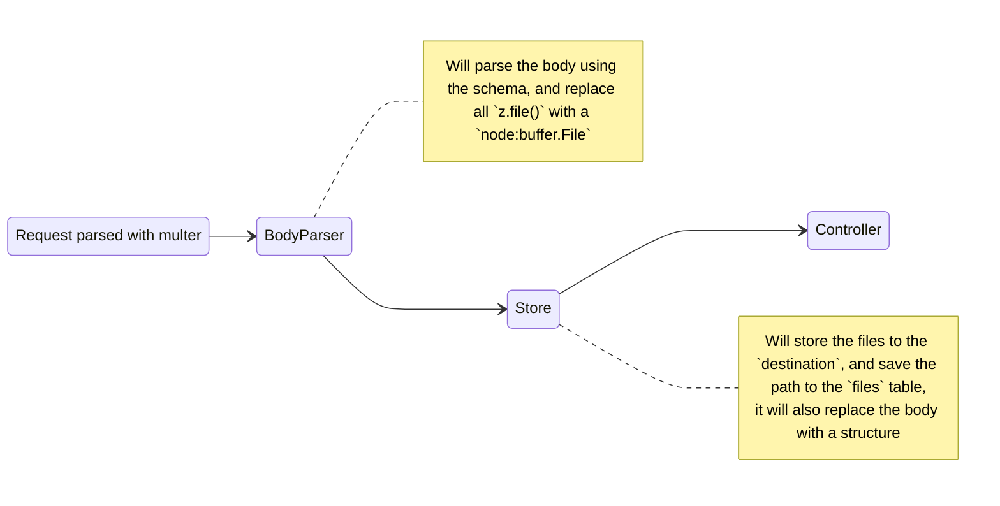

## Multipart

### `@UseMultipartBody`

Will parse a `multipart/form-data` encoded body with a zod schema.
If the body contains files, it will try to store them to the S3 compatible
storage available.

**properties**

| name          | description                                                                                                   |
| ------------- | ------------------------------------------------------------------------------------------------------------- |
| schema        | The zod schema for the body. It acts as a special DTO for multipart data                                      |
| destination   | An optional function that returns the destination path in the S3 storage                                      |
| overrideFiles | When true (by default) the interceptor will replace all files by a simple object referring to the stored file |
| deleteOnFail  | If the request fails, the interceptor will delete the file from the S3 storage, unless `false`                |

**sequence**



### Examples:

I want to attach pictures to an existing report.

```ts
import { FILE_EXTENSIONS, type FileMimeType } from 'src/framework/files';
import { UseMultipartBody, type Multipart } from 'src/framework/files/multipart';

const ReportPictureDto = {
  files: z
    .array(
      // only allow max 5 images, of less than 5Mb each
      z
        .file()
        .mime('image/*')
        .max(5 * 1024 * 1024),
    )
    .max(5),
};

@Post('/reports/:reportId/images')
@UseMultipartBody({
  // Will delete all files, if the request fails
  // Overrides the `request.body.files` with
  //       `{ id: string; name: string; path: string; mimeType: FileMimeType }`
  schema: ReportPicturesDto,
  destination: ({ id, request, mimeType }) =>
    `reports/${request.params.reportId}/${id}.${FILE_EXTENSIONS[mimeType]}`,
})
attachReportImages(
  @Body() { files }: Multipart<z.infer<typeof ReportPictureDto>>
) {
  return this.reports.attach({ fileIds: files.map(({ id }) => id)});
}
```

I want to to keep the buffer available for pipes

```ts
const ImportDto = z.object({ file: z.file().mime(FILE_MIME_TYPES.xslx) })

class ImportPipe implements PipeTransform<z.infer<typeof ImportDto>, number> {
  // ...
}

@Post('/import')
@UseMultipartBody({
  schema: ImportDto,
  destination: ({ id, mimeType }) => `imports/${id}.${FILE_EXTENSIONS[mimeType]}`,

  // Will keep a `node:buffer.File` instead of replacing it with `{ id: string... }`
  overrideFiles: false,
  // Even if the request fails, we keep the file stored on the S3 (e.g. for debugging purposes)
  deleteOnFail: false,
})
import(
  @Body(ImportPipe) linesCount: number,
) {
  // ...
}
```

I want to parse the multipart body, with files, but I don't want to store them

```ts
const ImportDto = z.object({ file: z.file().mime(FILE_MIME_TYPES.xslx) })

@Post('/import')
@UseMultipartBody({ schema: ImportDto })
import(
  @Body() body: z.infer<typeof ImportDto>,
) {
  // ...
}
```
